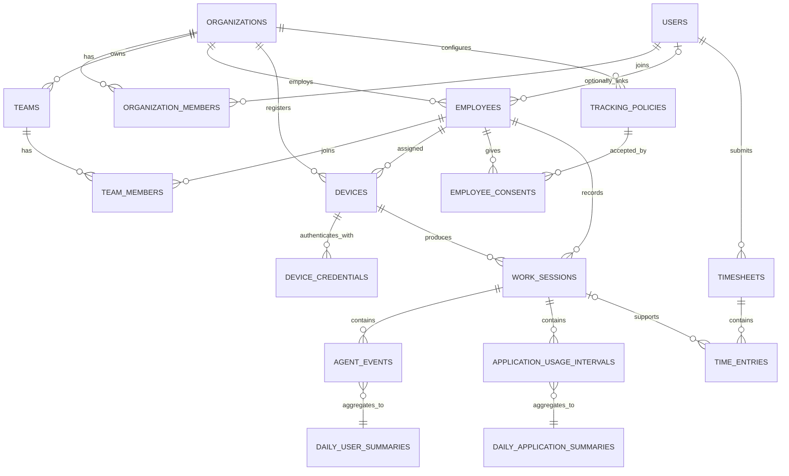

# Database design blueprint

This document is the proposed data model for the Workforce Platform. It is a design artifact, not an instruction to create every table now. Tables marked **current** already exist in the Drizzle schema; all other tables are deferred until their product phase is approved.

## Design principles

1. `users` is the global Better Auth identity for web access; `employees` represents workforce members and does not require a web account.
2. `organizations` is the tenant boundary. Every tenant-owned row carries `organization_id`.
3. Browser sessions and desktop device credentials are separate identity systems.
4. Collection policy, consent, retention, and audit capability must exist before activity collection.
5. Store UTC instants as `timestamp with time zone`; store the IANA time zone used for calendar calculations separately.
6. Raw collection data is append-only. Corrections happen in user-facing time records or derived summaries.
7. Do not store passwords, plaintext device secrets, keystrokes, browser history, or unnecessary window contents.
8. Detailed data and summary data have separate retention rules.

## Naming and column conventions

- PostgreSQL names use `snake_case`; Drizzle/TypeScript properties use `camelCase`.
- Primary keys are UUIDs.
- Tenant-owned tables include `organization_id` and indexes beginning with `organization_id`.
- Mutable business records use `created_at` and `updated_at`; append-only records use `occurred_at` and/or `received_at`.
- Secrets are stored only as one-way hashes with an optional non-secret prefix for identification.
- Statuses use constrained enums or check constraints when the lifecycle is stable.

## High-level relationship map



## Module 1: identity and organization

These tables are **current** and remain the foundation.

| Table | Responsibility | Important rules |
| --- | --- | --- |
| `users` | Canonical Better Auth identity for web access | Email unique; not tenant-owned |
| `sessions` | Browser login sessions | Never used by the desktop agent |
| `accounts` | Better Auth login credentials/providers | Passwords are hashes managed by Better Auth |
| `verifications` | Expiring authentication verification values | Expire and delete promptly |
| `organizations` | Tenant root | Slug unique |
| `organization_members` | User-to-organization membership and role | Unique `(organization_id, user_id)` |
| `invitations` | Organization invitations | Expiring lifecycle; inviter is auditable |
| `employees` | Workforce member who may have no web account | Tenant-owned; optional `linked_user_id`; unique email within an organization when present |
| `teams` | Team within an organization | Unique name within an organization |
| `team_members` | Employee-to-team membership | Unique `(team_id, employee_id)`; same-tenant checks required |
| `devices` | Foundational employee device registration | References `employee_id`; no secret or collected activity in this table |

### Future hardening

- Add organization-scoped composite keys where they can enforce that related rows belong to the same tenant.
- Decide whether organization deletion is a controlled archival workflow instead of a large cascading delete.
- Add an organization time zone and lifecycle state only when the organization settings feature is implemented.

## Module 2: privacy, policy, consent, and audit

These tables must be introduced before monitoring data.

### `tracking_policies`

Versioned configuration describing what an organization is allowed to collect.

| Column | Purpose |
| --- | --- |
| `id`, `organization_id` | Identity and tenant boundary |
| `name`, `version` | Human-readable and immutable version identity |
| `application_usage_enabled` | Whether application usage may be collected |
| `idle_detection_enabled` | Whether idle intervals may be calculated |
| `screenshots_enabled` | Whether optional screenshots may be captured |
| `screenshot_interval_seconds` | Capture interval when enabled |
| `requires_consent` | Whether explicit acceptance is required |
| `effective_at`, `retired_at` | Policy lifecycle |
| `created_by_user_id`, `created_at` | Accountability |

Policy versions should be immutable after becoming effective. Create a new version instead of rewriting the policy an employee accepted.

### `employee_consents`

Evidence that a user was informed of and accepted or declined a specific policy version.

Core columns: `organization_id`, `employee_id`, `tracking_policy_id`, `status`, `presented_at`, `responded_at`, `revoked_at`, `notice_version`, `created_at`.

Unique rule: one current response per `(organization_id, employee_id, tracking_policy_id)`.

### `retention_policies`

Retention by data category rather than one global number.

Core columns: `organization_id`, `data_category`, `retention_days`, `effective_at`, `created_by_user_id`, `created_at`.

Suggested categories: `agent_events`, `application_usage`, `screenshots`, `time_entries`, `aggregates`, `audit_logs`.

### `audit_logs`

Append-only record of sensitive administrative actions and reads.

Core columns: `organization_id`, `actor_user_id`, `action`, `resource_type`, `resource_id`, `request_id`, `ip_address`, `metadata`, `occurred_at`.

Do not place secrets or full sensitive payloads in `metadata`. Audit sensitive reads such as screenshot access and exports, not only writes.

## Module 3: desktop enrollment and device identity

### `device_enrollment_codes`

Short-lived, one-time enrollment challenges created by an authorized web user.

Core columns: `organization_id`, `employee_id`, `code_hash`, `expires_at`, `used_at`, `created_by_user_id`, `created_at`.

The plaintext code is shown once and never stored.

### `device_credentials`

Revocable credentials used only by the versioned agent HTTP API.

Core columns: `organization_id`, `device_id`, `credential_prefix`, `credential_hash`, `expires_at`, `last_used_at`, `revoked_at`, `created_at`.

Rules:

- Store only a strong hash of the credential.
- Support rotation by allowing more than one credential during a short overlap.
- A revoked device or credential cannot ingest data.
- Never copy Better Auth cookies or browser session tokens into this table.

## Module 4: visible time tracking and timesheets

This phase can be implemented before application usage or idle detection.

### `work_sessions`

The user-visible start/stop interval produced by the agent.

Core columns: `organization_id`, `employee_id`, `device_id`, `tracking_policy_id`, `started_at`, `ended_at`, `end_reason`, `client_session_id`, `created_at`.

Rules:

- `client_session_id` is unique per device for idempotent retries.
- `ended_at` may be null only while a session is open.
- Prevent implausible or overlapping open sessions according to the product policy.

### `timesheets`

A user's review and approval container for a calendar period.

Core columns: `organization_id`, `employee_id`, `period_start`, `period_end`, `time_zone`, `status`, `submitted_at`, `approved_at`, `approved_by_user_id`, `created_at`, `updated_at`.

Suggested lifecycle: `draft`, `submitted`, `approved`, `rejected`, `locked`.

### `time_entries`

Human-reviewable intervals displayed on a timesheet.

Core columns: `organization_id`, `timesheet_id`, `employee_id`, `work_session_id`, `started_at`, `ended_at`, `source`, `note`, `created_by_user_id`, `created_at`, `updated_at`.

`source` distinguishes `agent`, `manual`, and `adjustment`. Manual corrections never rewrite raw agent events.

## Module 5: detailed activity collection

This module remains deferred until policy, consent, enrollment, visibility, and retention are working.

### `agent_events`

Append-only versioned event envelope accepted by the agent API.

Core columns: `organization_id`, `employee_id`, `device_id`, `work_session_id`, `client_event_id`, `event_type`, `schema_version`, `occurred_at`, `received_at`, `payload`.

Rules:

- Unique `(device_id, client_event_id)` makes retries idempotent.
- Validate `event_type` and `schema_version`; do not accept arbitrary payloads.
- Partition by time only when volume justifies it.
- No keystroke, password, clipboard, or browser-history event types.

### `applications`

Organization-scoped normalized application catalog.

Core columns: `organization_id`, `platform`, `application_key`, `display_name`, `executable_hash`, `created_at`, `updated_at`.

Avoid storing full executable paths or window titles by default because they may contain personal or customer data.

### `application_usage_intervals`

Intervals during which an application was in use.

Core columns: `organization_id`, `employee_id`, `device_id`, `work_session_id`, `application_id`, `started_at`, `ended_at`, `created_at`.

No productivity score belongs here. Classification and policy are separate concerns.

### `activity_intervals`

Coarse active/idle intervals created only when the policy permits idle detection.

Core columns: `organization_id`, `employee_id`, `device_id`, `work_session_id`, `state`, `started_at`, `ended_at`, `created_at`.

Store interval state, not individual mouse moves or key presses.

### `screenshot_records`

Metadata for optional screenshots. Binary files do not belong in PostgreSQL.

Core columns: `organization_id`, `employee_id`, `device_id`, `work_session_id`, `tracking_policy_id`, `captured_at`, `storage_object_key`, `mime_type`, `byte_size`, `status`, `deleted_at`, `created_at`.

The table is not implemented until encrypted object storage, redaction, access audit, retention deletion, and explicit user-visible capture state are designed.

## Module 6: aggregation and dashboard reads

Dashboards should query summary tables instead of scanning detailed events.

### `daily_user_summaries`

Core columns: `organization_id`, `employee_id`, `local_date`, `time_zone`, `tracked_seconds`, `active_seconds`, `idle_seconds`, `first_started_at`, `last_ended_at`, `calculated_at`, `source_version`.

Unique `(organization_id, employee_id, local_date)`.

### `daily_application_summaries`

Core columns: `organization_id`, `employee_id`, `application_id`, `local_date`, `usage_seconds`, `calculated_at`, `source_version`.

Unique `(organization_id, employee_id, application_id, local_date)`.

Aggregates are reproducible. `source_version` allows recalculation when aggregation logic changes.

## Indexing guide

Start indexes from the tenant predicate used by every authorized query.

Suggested patterns:

```text
(organization_id, employee_id)
(organization_id, employee_id, occurred_at)
(organization_id, device_id, occurred_at)
(organization_id, local_date)
```

Add indexes from measured query plans, not by indexing every column. Large append-only tables may later use time partitioning and BRIN indexes, but neither is required during the foundation phase.

## Deletion and retention behavior

- Authentication and membership rows may cascade when a disposable local tenant is deleted.
- Production activity data should be removed through an auditable retention job, not an unbounded cascade inside a web request.
- Revoking a user or device stops future ingestion; it does not silently rewrite historical records.
- User privacy deletion must define whether records are deleted, anonymized, or retained for a legally required period.
- Summary rows must not outlive their permitted source category unless the retention policy explicitly allows them.

## Safe schema-change workflow

During the current local-only phase:

1. Update this blueprint when a domain decision changes.
2. Add only the tables required by the next approved vertical slice.
3. Edit `packages/db/src/schema/index.ts`.
4. Run `bun run lint` and `bun run check-types`.
5. Review the proposed SQL and data-loss warnings from `bun db:push`.
6. Verify constraints and rows through `bun db:studio`.

For existing data, prefer expand → backfill → verify → contract. Before production, replace this local workflow with reviewed, versioned migrations, staging rehearsal, backups, and a forward-fix/rollback policy.

## Recommended rollout

### Phase 0 — current foundation

Public web identities, organizations/workspaces, memberships, employees, teams, invitations, and foundational device registration only.

### Phase 1 — privacy and device enrollment

Add `tracking_policies`, `employee_consents`, `retention_policies`, `audit_logs`, `device_enrollment_codes`, and `device_credentials`. No activity collection yet.

### Phase 2 — visible time tracking

Add `work_sessions`, `timesheets`, and `time_entries`. Tracking starts and stops visibly; no application usage, idle detection, or screenshots.

### Phase 3 — policy-controlled activity

Add `agent_events`, `applications`, `application_usage_intervals`, and `activity_intervals` only after explicit product and privacy approval.

### Phase 4 — aggregation

Add background aggregation and daily summary tables. Do not add productivity scoring as an implicit consequence of aggregation.

### Phase 5 — optional screenshots

Add screenshot metadata only after the complete storage, encryption, redaction, access-audit, notification, and retention design is approved.

## Decisions still requiring product input

1. Can a user have overlapping work sessions across two devices?
2. What is the timesheet period and who may approve it?
3. Are manual time corrections editable after approval, or represented as adjustments?
4. Which policy settings may a team override from the organization default?
5. Which jurisdictions require explicit consent versus notice?
6. What are the default and maximum retention periods per data category?
7. Are window titles ever required? The privacy-first default is no.
8. What does organization deletion mean: archive, scheduled purge, or immediate removal?

Until these decisions are made, the related tables should not be added to the physical Drizzle schema.
